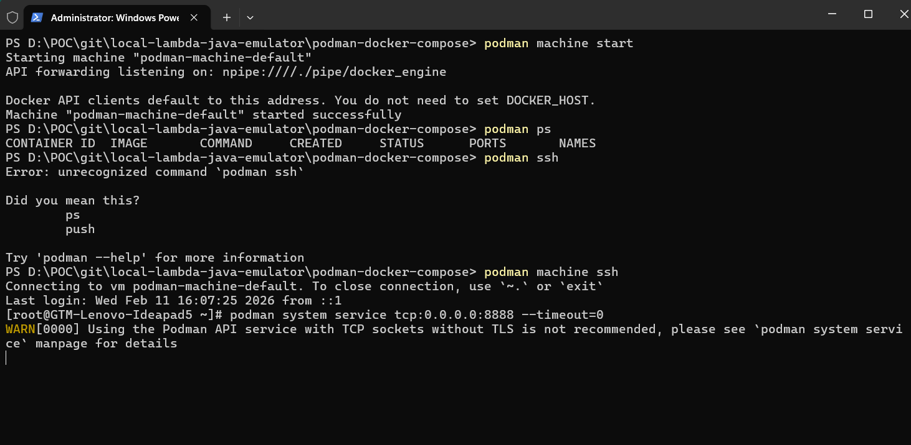
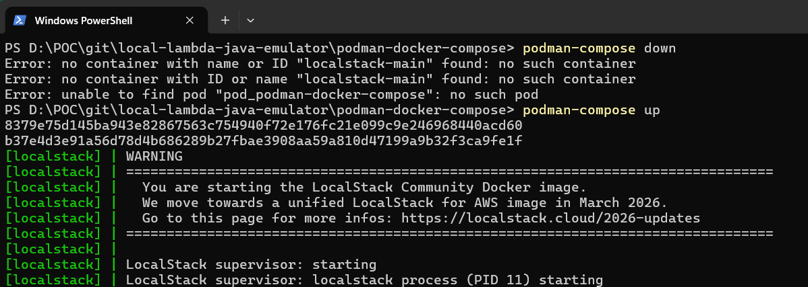
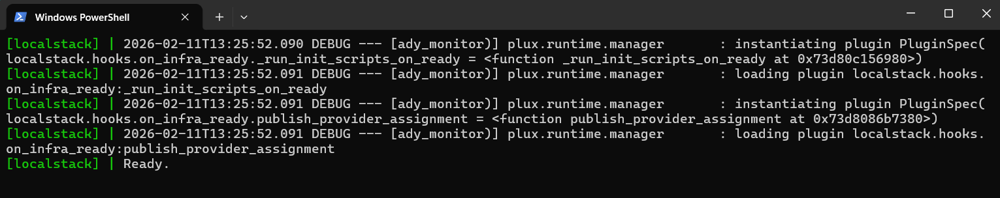
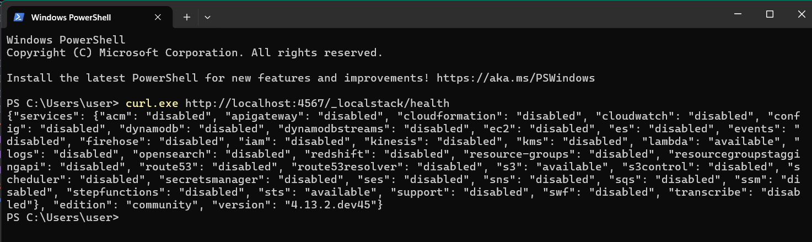

# Local AWS Lambda (Java) Using Localstack Emulator

This project is a high-performance **AWS Lambda function** built with **Java 25**, designed to efficiently compare files stored in **Amazon S3**. It calculates content equality using buffered streams to minimize memory overhead, making it ideal for processing large files.

The repository is specifically optimized for **local development and testing**, featuring seamless integration with **LocalStack** and **Podman/Docker**. It uses a local SQLite database for results during local runs and supports PostgreSQL for production deployments.

- **Stack**: Java 25, AWS SDK v2, Maven, Terraform.
- **Local Dev**: LocalStack, Podman/Docker, SQLite.
- **Test**: Testcontainers, H2 in-memory DB, Mockito, Junit-jupiter  

> [!NOTE]
> **LocalStack Free**: This setup is compatible with LocalStack Community Edition. We use a local SQLite database in `/tmp` for storage when running locally.

> [!IMPORTANT]
> **Container Engine (Docker/Podman)**: LocalStack requires access to a container engine socket to run Lambda functions.
> 
> **If using Docker (Windows/Mac/Linux):**
> - Mount: `-v /var/run/docker.sock:/var/run/docker.sock`
> 
> **If using Podman (Windows - version 5.x):**
> 1.  **Expose Podman API**: Open a **Regular PowerShell** window and run:
>     ```powershell
>     podman system service tcp:0.0.0.0:8888 --timeout=0
>     ```
>     *If needed, run it after doing ssh (as shown in the attached images)* 
>
>     *Keep this window open.*
>
>     
>
> 2.  **Restart LocalStack**:
>     ```bash
>     podman-compose down
>     podman-compose up -d
>     ```
> 3.  **Verify**: Run `curl.exe http://localhost:4567/_localstack/health` in a new terminal.
>
>     
>     
>     
>
> 4. Alternatively, if on Linux/WSL2, mount `/run/user/1000/podman/podman.sock` (check your path with `podman info`).

## Prerequisites
- Java 25
- Maven
- Podman (*_How To_*: https://github.com/gsbuddy87/sb-kafka-si?tab=readme-ov-file#install-podman-ignore-if-podman--docker-is-already-running-in-your-local-machine)
- Terraform
- LocalStack (running on `localhost:4567`)
- `awslocal` CLI (optional, but recommended for easy interaction)

```bash
mvn clean package
```

## 2. Running Tests

### Unit Tests
Run unit tests only:
```bash
mvn test
```

### Integration Tests
The project includes integration tests that verify end-to-end functionality with S3 and database interactions.

**Run all tests (unit + integration):**
```bash
mvn verify
```

**Run only integration tests:**
```bash
mvn verify -DskipUTs
```

**Run specific integration test:**
```bash
mvn test -Dtest=HandlerIT
```

**Test Setup:**
- Uses **H2 in-memory database** (no external database needed)
- Uses **Testcontainers** with **LocalStack** for S3 emulation
- Requires **Docker or Podman** running locally

**What's Tested:**
- ✅ S3 file upload and retrieval
- ✅ File comparison (identical and different files)
- ✅ Database record creation
- ✅ Handler response validation

## 3. Local Verification (LocalStack)

1.  **Deploy Infrastructure**:
    ```powershell
    cd terraform
    terraform init
    terraform apply -var="environment=local" -auto-approve
    ```

2.  **Upload Test Files**:
    ```powershell
    # File 1
    echo "This is some test content" > file1.txt
    aws --endpoint-url=http://localhost:4567 s3 cp file1.txt s3://my-comparison-bucket-emulator/file1.txt

    # File 2 (Identical)
    aws --endpoint-url=http://localhost:4567 s3 cp file1.txt s3://my-comparison-bucket-emulator/file2.txt

    # File 3 (Different)
    echo "This is DIFFERENT content" > file3.txt
    aws --endpoint-url=http://localhost:4567 s3 cp file3.txt s3://my-comparison-bucket-emulator/file3.txt
    ```
    ```powershell
    NOTE:
    - Please create big files to test the performance of the lambda function. For example, create a file with 1GB of data.
    - A sample script to create big files is available in the docs/sample-test-files/scripts directory. Modify this script to create files of your choice (this script requires python).
    ```

3.  **Invoke Lambda**:
    Prepare the payload ([request.json](file:///d:/POC/git/local-lambda-java-emulator/request.json)):
    ```json
    {
      "bucketName": "my-comparison-bucket-emulator",
      "key1": "file1.txt",
      "key2": "file2.txt"
    }
    ```
    Invoke:
    ```powershell
    aws --endpoint-url=http://localhost:4567 lambda invoke --function-name s3-comparator --region us-east-1 --payload file://docs//sample-test-files//request.json --cli-binary-format raw-in-base64-out response.json

    type response.json
    ```

4.  **Verification Output**:
    - The `response.json` should contain: `Comparison complete. Match ID: ... Result: Content and size match.`
    - Check the SQLite results in the Lambda logs:
      ```powershell
      aws --endpoint-url=http://localhost:4567 logs tail /aws/lambda/s3-comparator --region us-east-1
      ```

## AWS Deployment [NOT Tested Yet]
To deploy to actual AWS:
1.  Ensure you have your AWS credentials configured.
2.  Run:
    ```bash
    terraform apply -var="environment=aws"
    ```
